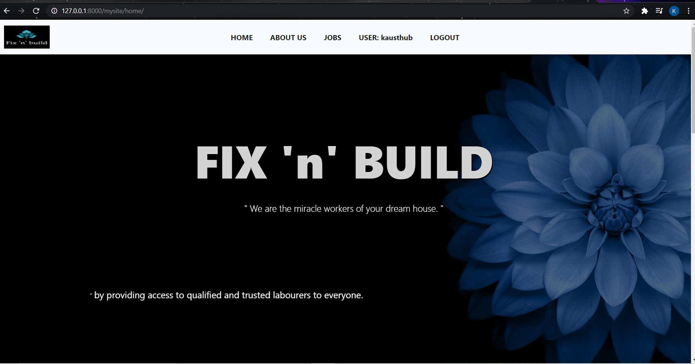

# FIX 'n' BUILD

Fix-n-build is a online platform to hire workers (carpenters, plumbers, painters etc..). It is a website built using django framework. This makes the tiresome processes of hiring workers a simple one where u can hire workers with just a few clicks!

# Features completed
1. User authentication and creation. (registration).
2. Job application forms and storing the necessary information.
3. Sorting workers based on location, wage and type.
4. Sending confirmation emails whenever necessary.

# Project set-up
In a windows computer :
1. pip install virtualenv
2. pip install django
3. activate env
4. python manage.py makemigrations
5. python manage.py migrate
6. python manage.py runserver

# Future features
1. An admin page.
